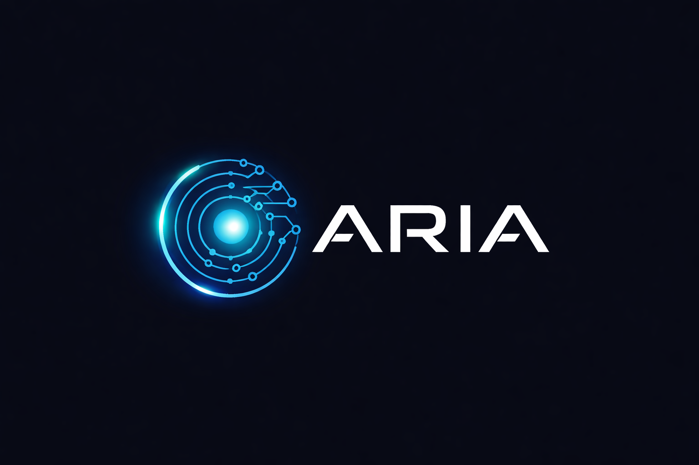

# ARIA
ARIA - Artificial Reasoning &amp; Intelligent Assistant

ARIA is a mixed hardware/software project.
While working with some specific software (ROS, Unreal, NVIDIA Tools, ...) I quickly reached the limitations of my existing
equipment (e.g. Laptops with Windows, no native Linux, very limited with regards to GPU).

On the other side I was curious what I can achieve by repurposing old hardware with a small room footprint.

My first experiments (which are not part of this documentation) where based on DELL Wyse Thin Client:
Encouraged by some Youtube Videos, including one video from c't 3003 (https://www.youtube.com/watch?v=K10bMgX0qoc),
I equiped one of those tiny machines with 32GB of RAM, a 1TB NVME Disk and installed LINUX on it.

But to achive my ambitions to use at least some of the above mentioned tools, something bigger (not in size) must be build.
Therefore I started with a Lenovo ThinkCentre M910x, which I could aquire for rather little money but are capable to do more.
It came as a kind of "barebone" without RAM and DISK, but equipped with an Core i5-7700T/3GHz processor.
Not bad compared to the Dell Wyse :-)

My goal was
- 64GB RAM
- 2TB NVME Disk
- CPU Upgrade to Core i7-7700T
- NVIDIA GPU
- LINUX (preferably CachyOS)
- AI Software/Tools to build a personal assistant

Project ARIA was born!

Read in the following chapters, what went well (and what not), what steps where necessary to meet my expectations and how my journey towards 
ARIA as my personal assistent went.
